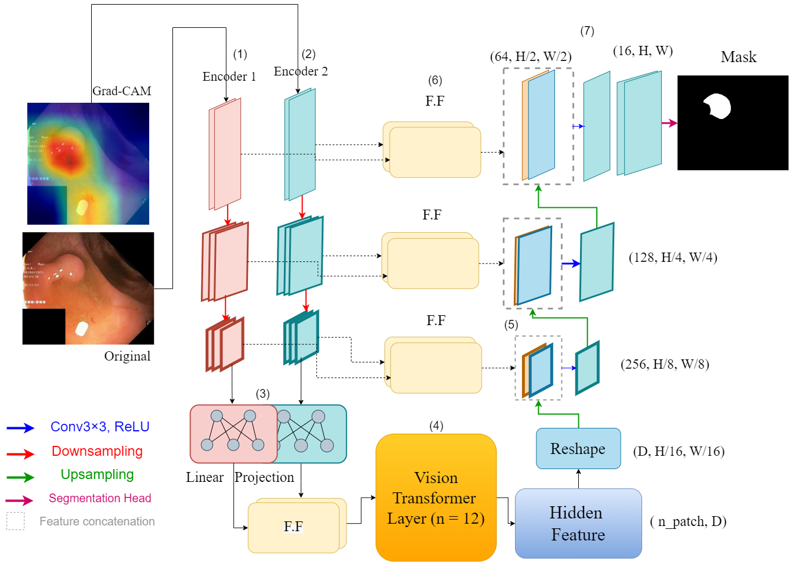

## Model Architecture

*Grad-TransUNet Architecture Figure from Official Paper*

## Dependencies
- Python 3.6+
- `pip install -r requirements.txt`

## Dataset
- kvasir dataset was used for training.
- First, you should generate the Grad-Cam Images with this github repository[gradcam pytorch](https://github.com/kazuto1011/grad-cam-pytorch)
- you can choose differnet models to generate the heatmaps based on them (in my work resenet was the best model in generating heatmaps!)

## Training
- Training process can be started with following command.
    - `python main.py --mode train --model_path ./path/to/model --train_path ./path/to/trainset  --train_sail_path ./path/to/gradcam-trainset --test_path ./path/to/testset  --test_sail_path ./path/to/gradcam-testset`

## Inference
- After model is trained, inference can be run with following command.
    - `python main.py --mode inference --model_path ./path/to/model --image_path ./path/to/image`
    
## Other Implementations
- [Self Attention CV / The AI Summer](https://github.com/The-AI-Summer/self-attention-cv)
- [SOTA Vision / 04RR](https://github.com/04RR/SOTA-Vision)

## References
- [1] [TransUNet: Transformers Make Strong Encoders for Medical Image Segmentation](https://arxiv.org/abs/2102.04306)
- [2] [Automatic segmenting teeth in X-ray images: Trends, a novel data set, benchmarking and future perspectives](https://www.sciencedirect.com/science/article/abs/pii/S0957417418302252)
- [3] [GitHub Repository of Dataset](https://github.com/IvisionLab/dental-image)
